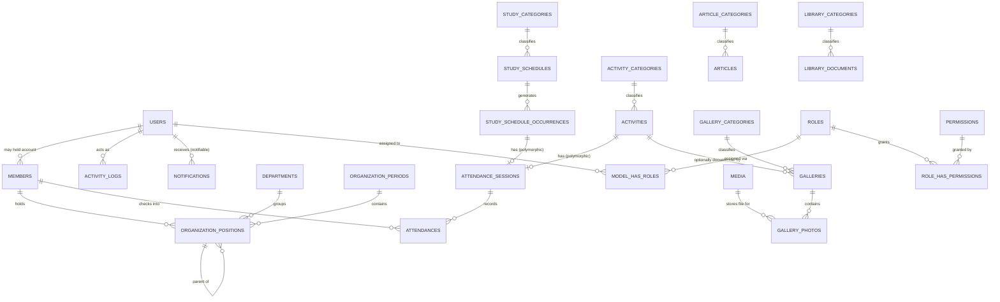

# Mudes.co — Database Specification

| Field | Value |
|---|---|
| Document | DATABASE_SPECIFICATION.md |
| Companion Documents | PROJECT_SPECIFICATION.md v1.0.0, BACKEND_ARCHITECTURE.md v1.0.0, API_SPECIFICATION.md v1.0.0 |
| Version | **1.1.0** (Revision 1 — see §11 Revision History) |
| Status | Draft for Development |
| Database Engine | PostgreSQL 16+ |
| Date | 2026-07-18 |

This document expands `PROJECT_SPECIFICATION.md` into a complete, unambiguous database design. It contains **no SQL and no migration/model code** — every rule here must be translated into Laravel migrations/models by the implementer exactly as described.

> **Revision 1 notice:** this version normalizes several taxonomies that were previously handled as ad hoc lookups or logical views (Departments, Gallery Categories, Activity Categories, Study Categories) into dedicated tables, enriches `members` and `organization_positions`, adds a `notifications` table, and extends `settings`. Every change preserves the v1.0.0 shape wherever possible — additive columns, no renamed/removed columns except one documented case (`members.is_active` → `members.status`). Full detail in §11. `PROJECT_SPECIFICATION.md`, `BACKEND_ARCHITECTURE.md`, and `API_SPECIFICATION.md` are **not** updated by this revision (per instruction) — §11 notes exactly where they now lag this document and will need their own follow-up revision.

---

## Table of Contents

1. Purpose & Scope
2. Global Conventions
3. Table Catalog
4. Detailed Table Specifications
5. Enum / Status Value Catalog
6. Relationships & ERD Explanation
7. Indexing Strategy Summary
8. Data Integrity Constraint Summary
9. Cascade & Delete Behavior Matrix
10. Appendix — Clarifications Beyond PROJECT_SPECIFICATION.md
11. Revision History

---

## 1. Purpose & Scope

This document is the single source of truth for the Mudes.co physical database design. It covers every table required by the functional modules in `PROJECT_SPECIFICATION.md` §3, including tables owned by adopted third-party packages (Spatie Permission, Spatie Media Library, Laravel Notifications), described here in their project-adapted form. Revision 1 additionally normalizes taxonomy concepts (Departments, Gallery/Activity/Study Categories) that `PROJECT_SPECIFICATION.md`/`API_SPECIFICATION.md` had treated as logical views over other tables, closing real scalability and clarity gaps identified in review — see §11 for the full rationale per change.

---

## 2. Global Conventions

These rules apply to **every table** unless a table's own section states an explicit exception.

### 2.1 UUID Primary Key Strategy

Every table's primary key column is named `id`, type **`uuid`** (PostgreSQL native `uuid` type), generated at the **application layer** using **UUIDv7** (time-ordered), to preserve monotonic insertion order and avoid B-tree fragmentation from random keys. Unchanged from v1.0.0.

### 2.2 Audit Columns

Every project-owned table includes:

| Column | Type | Nullable | FK Target | On Delete |
|---|---|---|---|---|
| `created_by` | `uuid` | Yes | `users.id` | `SET NULL` |
| `updated_by` | `uuid` | Yes | `users.id` | `SET NULL` |
| `deleted_by` | `uuid` | Yes | `users.id` | `SET NULL` |

Nullable because system-seeded rows have no acting user. Populated automatically by an Observer at create/update/soft-delete time.

### 2.3 Soft Delete Strategy

Every project-owned table includes `deleted_at timestamptz`, nullable. Queries are scoped to `deleted_at IS NULL` by default. Any `UNIQUE` constraint that would otherwise block value reuse is declared as a **partial unique index** scoped `WHERE deleted_at IS NULL`.

### 2.4 Timestamps

`created_at`/`updated_at timestamptz`, not null, app-set at insert/update.

### 2.5 Naming Conventions

Unchanged from v1.0.0 — plural `snake_case` tables, `snake_case` columns, `<singular_referenced_table>_id` foreign keys, `idx_`/`uq_`/`chk_` prefixes for indexes/constraints.

### 2.6 Enum Representation Policy

Status/category-like columns are `varchar` + `CHECK`, not native Postgres `ENUM`, so a new allowed value is a constraint alteration, not a type migration. Full catalog in §5.

### 2.7 Third-Party / Framework-Convention Tables

Spatie Laravel-Permission (`roles`, `permissions`, and their pivots) and Spatie Media Library (`media`) ship their own minimal schemas, adapted here to UUID keys. **Revision 1 adds** Laravel's native Notifications schema (`notifications`) to this category — see §4.9. For all four:

- **Primary keys are overridden to `uuid`**, per the project-wide "never use integer IDs" rule.
- **Audit columns and soft delete are added to `media`** (as in v1.0.0) because media rows are user-facing content assets with the same lifecycle expectations as any other content table.
- **Audit columns and soft delete are deliberately NOT added to** `roles`, `permissions`, `model_has_roles`, `model_has_permissions`, `role_has_permissions`, or (new in Revision 1) `notifications` — each is a low-churn or ephemeral system table whose own package/framework query logic assumes its native shape, and for which "who deleted this and when" carries no business meaning. Each exception is restated in its own table section.

### 2.8 Referential Integrity — General Rule

Every foreign key is enforced at the DB level **except** polymorphic references (`attendance_sessions.source_id`, `media.model_id`, `activity_logs.subject_id`, and — new — `notifications.notifiable_id`), which cannot carry a single-target FK constraint and are integrity-checked at the application layer.

### 2.9 Taxonomy Table Shape (New in Revision 1)

Revision 1 introduces four new lookup/taxonomy tables (`departments`, `gallery_categories`, `activity_categories`, `study_categories`) and upgrades two existing ones (`article_categories`, `library_categories`) to a single **shared shape**, so every "thing that categorizes content" in this schema looks and behaves identically — one convention instead of six ad hoc ones:

| Column | Type | Nullable | Default | Notes |
|---|---|---|---|---|
| `name` | `varchar(100)` | No | — | |
| `slug` | `varchar(120)` | No | — | unique partial, `WHERE deleted_at IS NULL` |
| `description` | `text` | Yes | `NULL` | |
| `icon` | `varchar(100)` | Yes | `NULL` | frontend-interpreted icon identifier (e.g. an icon-library key or emoji) — the database only stores the identifier, not the rendering |
| `color` | `varchar(7)` | Yes | `NULL` | hex color code (e.g. `#4F46E5`), frontend-interpreted |
| `display_order` | `integer` | No | `0` | controls frontend presentation order; drag-and-drop reorder writes this column |
| `is_active` | `boolean` | No | `true` | disable without deleting |
| + baseline | | | | audit + soft delete + timestamps |

Every table adopting this shape is documented in §4 with only its deviations from this table (if any) — the full column list is not repeated six times.

---

## 3. Table Catalog

| # | Table | Category | Status |
|---|---|---|---|
| 1 | `users` | Core / Auth | unchanged |
| 2 | `members` | Core | **modified** |
| 3 | `roles` | Auth (package) | unchanged |
| 4 | `permissions` | Auth (package) | unchanged |
| 5 | `model_has_roles` | Auth (package) | unchanged |
| 6 | `model_has_permissions` | Auth (package) | unchanged |
| 7 | `role_has_permissions` | Auth (package) | unchanged |
| 8 | `media` | Core (package, extended) | unchanged |
| 9 | `notifications` | Core (package convention) | **new** |
| 10 | `departments` | Taxonomy | **new** |
| 11 | `organization_profiles` | Organization | unchanged |
| 12 | `organization_periods` | Organization | unchanged |
| 13 | `organization_positions` | Organization | **modified** |
| 14 | `study_categories` | Taxonomy | **new** |
| 15 | `study_schedules` | Schedule | **modified** |
| 16 | `study_schedule_occurrences` | Schedule | unchanged |
| 17 | `activity_categories` | Taxonomy | **new** |
| 18 | `activities` | Content | **modified** |
| 19 | `article_categories` | Taxonomy | **modified** (upgraded to §2.9 shape) |
| 20 | `articles` | Content | unchanged |
| 21 | `gallery_categories` | Taxonomy | **new** |
| 22 | `galleries` | Content | **modified** |
| 23 | `gallery_photos` | Content | unchanged |
| 24 | `library_categories` | Taxonomy | **modified** (upgraded to §2.9 shape) |
| 25 | `library_documents` | Content | unchanged |
| 26 | `announcements` | Content | unchanged |
| 27 | `attendance_sessions` | Attendance | unchanged |
| 28 | `attendances` | Attendance | unchanged |
| 29 | `settings` | System | **modified** |
| 30 | `activity_logs` | System | unchanged |

---

## 4. Detailed Table Specifications

Baseline columns (`id`, `created_by`, `updated_by`, `deleted_by`, `created_at`, `updated_at`, `deleted_at`) are implied on every project-owned table per §2.2–§2.4 and not repeated below unless a table deviates.

### 4.1 `users` — unchanged

See v1.0.0 shape: `name`, `email` (unique partial), `email_verified_at`, `password`, `is_active`, `remember_token`, self-referential audit columns.

### 4.2 `members` — modified

**Purpose:** Stable identity for youth-community members, independent of staff `users` accounts — reaffirmed and strengthened in Revision 1 per the explicit requirement that Members represent *organizational* membership, not authentication.

| Column | Type | Nullable | Default | Notes |
|---|---|---|---|---|
| `full_name` | `varchar(150)` | No | — | unchanged |
| `gender` | `varchar(10)` | Yes | `NULL` | `male`, `female` — nullable for backward compatibility with rows migrated before this column existed |
| `birth_date` | `date` | Yes | `NULL` | |
| `phone` | `varchar(20)` | Yes | `NULL` | unchanged |
| `photo_media_id` | `uuid` | Yes | `NULL` | FK → `media.id`, `SET NULL` |
| `join_date` | `date` | Yes | `NULL` | recommended for all new members going forward; nullable to accommodate historical members whose join date was never recorded |
| `status` | `varchar(20)` | No | `'active'` | `active`, `inactive`, `alumni`, `moved_out` — **replaces** `is_active` (see Migration Notes, §11) |
| `notes` | `text` | Yes | `NULL` | free-form admin notes |
| `user_id` | `uuid` | Yes | `NULL` | FK → `users.id`, `SET NULL` — unchanged; already satisfied "User account optional, Member independent of login" in v1.0.0 |
| + baseline | | | | |

**Indexes:** `idx_members_full_name`, `idx_members_user_id` (unchanged), plus **new** `idx_members_status`, `idx_members_join_date`.

**Business Rules:** unchanged from v1.0.0 — a member is the stable identity attendance aggregates against; a member is never mandatory on an attendance row (walk-ins by name only). **New:** `status = 'alumni'`/`'moved_out'` members remain fully queryable in history (attendance, past organization positions) but are excluded from "current members" listings by default, mirroring how `is_active = false` behaved in v1.0.0 but with richer semantics.

### 4.3 `roles`, `permissions`, `model_has_roles`, `model_has_permissions`, `role_has_permissions` — unchanged

See v1.0.0 shape and rationale (§2.7).

### 4.4 `media` — unchanged

See v1.0.0 shape: UUID PK override, `model_type`/`model_id` (polymorphic), `collection_name`, file metadata, `custom_properties` (`alt_text`, `caption`), audit + soft delete extension.

### 4.5 `notifications` — new

**Purpose:** Backing store for Laravel's native Notification system (`BACKEND_ARCHITECTURE.md` §16), supporting Announcement digests, Attendance/Study reminders, system notifications, and a future push channel — without a schema change when that channel is added.

| Column | Type | Nullable | Default | Notes |
|---|---|---|---|---|
| `id` | `uuid` | No | — | PK (overridden from Laravel's default `bigint`) |
| `type` | `varchar(255)` | No | — | fully-qualified Notification class, e.g. `App\Notifications\NewAnnouncement` |
| `notifiable_type` | `varchar(255)` | No | — | polymorphic — `User` (staff) or `Member` (future member-facing notifications) |
| `notifiable_id` | `uuid` | No | — | polymorphic; no DB FK (§2.8) |
| `data` | `jsonb` | No | — | notification payload (message, related resource id, action URL) |
| `read_at` | `timestamptz` | Yes | `NULL` | `NULL` = unread |
| `created_at` / `updated_at` | `timestamptz` | No | — | |

**Deliberate deviation from baseline (§2.2/§2.3):** no `created_by`/`updated_by`/`deleted_by`/`deleted_at`. A notification is system-generated (there is no "actor" to attribute it to beyond the triggering event, which `data` already records) and is ephemeral — once read and stale, it is **hard-deleted** by a scheduled retention job (e.g., 90 days), not soft-deleted; soft-delete bookkeeping on a high-volume, self-expiring table would be pure overhead with no audit value, unlike `activity_logs` (§4.30) which is append-only precisely *because* it must never be pruned.

**Indexes:** `idx_notifications_notifiable` on (`notifiable_type`, `notifiable_id`) — the standard "list my notifications" lookup; `idx_notifications_unread` **partial** index on (`notifiable_type`, `notifiable_id`) `WHERE read_at IS NULL` — the single most frequent query (unread count/badge) never has to scan already-read rows.

**Future Push Notification compatibility:** the `type` column already accommodates additional channels per notification without any schema change — see §11 Architectural Decisions.

### 4.6 `departments` — new

**Purpose:** Dedicated organizational grouping, replacing the "logical view" approach `PROJECT_SPECIFICATION.md`/`API_SPECIFICATION.md` previously used (top-level `organization_positions` standing in for departments). Adopts the shared Taxonomy Table Shape (§2.9) with one addition to its uniqueness rule.

Full column list = §2.9's shape (`name`, `slug`, `description`, `icon`, `color`, `display_order`, `is_active` + baseline). No deviations beyond:

**Indexes/Constraints:** in addition to the standard `uq_departments_slug` (partial unique on `slug`), **`uq_departments_name`** — a partial unique index on `name` `WHERE deleted_at IS NULL`, since the business rule explicitly requires department *names* (not just slugs) to be unique — the only taxonomy table in this schema with that additional stated requirement.

**Business Rules:** a department can be enabled/disabled (`is_active`) without deleting it — disabling hides it from the public org-chart grouping but preserves its position assignments. `display_order` controls its position in the public org-chart and any department-filterable admin list.

**Relationship:** `departments` 1—* `organization_positions` (§4.7).

### 4.7 `organization_periods` — unchanged

See v1.0.0 shape: `label`, `start_date`, `end_date`, `is_active` (partial-unique enforced single active period).

### 4.8 `organization_positions` — modified

**Purpose:** A position within a period's org chart, now department-scoped, type-classified, and depth-tracked to support unlimited hierarchy and drag-and-drop ordering at any depth.

| Column | Type | Nullable | Default | Notes |
|---|---|---|---|---|
| `organization_period_id` | `uuid` | No | — | FK → `organization_periods.id`, `CASCADE` — unchanged |
| `department_id` | `uuid` | Yes | `NULL` | **new** — FK → `departments.id`, `RESTRICT` (§9) |
| `parent_position_id` | `uuid` | Yes | `NULL` | FK → `organization_positions.id` (self-referential), `SET NULL` — unchanged; this is the schema element that already satisfies the requested "nullable `parent_id`" and already supports unlimited hierarchy depth |
| `member_id` | `uuid` | Yes | `NULL` | FK → `members.id`, `SET NULL` — unchanged |
| `title` | `varchar(150)` | No | — | free-text human label, e.g. "Ketua", "Koordinator Bidang Humas" — unchanged |
| `position_type` | `varchar(20)` | No | `'member'` | **new** — `chairman`, `vice_chairman`, `secretary`, `treasurer`, `coordinator`, `member` — classifies the position's *function* (drives consistent org-chart iconography/sorting/permission-mapping) independently of the free-text `title`, which stays fully editable/translatable without affecting how the system treats the position |
| `level` | `smallint` | No | `0` | **new** — denormalized hierarchy depth (root = `0`); maintained by the Application layer (`OrganizationPositionService`) whenever a position's `parent_position_id` changes, recomputing the changed position's entire subtree — not itself authoritative (the `parent_position_id` chain is the source of truth), purely a read-optimization for depth-based filtering/sorting and indentation rendering without a recursive query on every read |
| `display_order` | `integer` | No | `0` | sibling ordering — unchanged, now also the basis for drag-and-drop reordering per the stated business rule |
| + baseline | | | | |

**Constraints:** `chk_organization_positions_type` CHECK (`position_type IN ('chairman','vice_chairman','secretary','treasurer','coordinator','member')`).

**Indexes:** existing `idx_organization_positions_period`, `idx_organization_positions_parent`, plus **new** `idx_organization_positions_department`, `idx_organization_positions_type`, and composite **`idx_organization_positions_department_level`** on (`department_id`, `level`) — supports the common "list this department's positions ordered by hierarchy depth" query in one index scan rather than a filter-then-sort.

**Business Rules:** cycle prevention (a position cannot become its own ancestor) remains a Service-layer invariant, unchanged from v1.0.0 — still not DB-expressible. **New:** reassigning a position's `parent_position_id` triggers a recompute of `level` for it and every descendant, performed inside the same transaction as the reassignment.

### 4.9 `study_categories` — new

**Purpose:** Classify recurring study schedules (Weekly Study, Monthly Study, Youth Study, Special Study, Ramadan, National Event) as first-class, admin-manageable rows rather than a fixed code-level list — so a new study type never requires a code change.

Full column list = §2.9's Taxonomy Table Shape. No deviations.

**Relationship:** `study_categories` 1—* `study_schedules` (§4.10).

### 4.10 `study_schedules` — modified

Adds one column to the v1.0.0 shape:

| Column | Type | Nullable | Default | Notes |
|---|---|---|---|---|
| `study_category_id` | `uuid` | No | — | **new** — FK → `study_categories.id`, `RESTRICT` |
| *(all v1.0.0 columns unchanged)* | | | | `day_of_week`, `start_time`, `end_time`, `topic`, `ustadz_name`, `location`, `is_active` |

**Indexes:** existing `idx_study_schedules_day_active`, plus **new** `idx_study_schedules_category`.

**Migration note:** `study_category_id` is `NOT NULL`, which is a breaking addition to an existing table — see §11's Migration Notes for the required backfill step (a default "Weekly Study" category must be seeded and existing rows backfilled to it before the `NOT NULL`/`RESTRICT` constraint can be applied).

### 4.11 `study_schedule_occurrences` — unchanged

See v1.0.0 shape: `study_schedule_id`, `occurrence_date`, `status`, `override_note`.

### 4.12 `activity_categories` — new

**Purpose:** Classify Activities independently of the Activities table itself, replacing any ad hoc categorization.

Full column list = §2.9's Taxonomy Table Shape. No deviations.

**Relationship:** `activity_categories` 1—* `activities` (§4.13).

### 4.13 `activities` — modified

Adds one column to the v1.0.0 shape:

| Column | Type | Nullable | Default | Notes |
|---|---|---|---|---|
| `activity_category_id` | `uuid` | No | — | **new** — FK → `activity_categories.id`, `RESTRICT` |
| *(all v1.0.0 columns unchanged)* | | | | `title`, `slug`, `description`, `start_at`, `end_at`, `location`, `status`, `cover_media_id` |

**Indexes:** existing `uq_activities_slug`, `idx_activities_status_start`, plus **new** `idx_activities_category`.

**Migration note:** same `NOT NULL` backfill requirement pattern as `study_schedules.study_category_id` — see §11.

### 4.14 `article_categories` — modified (upgraded to §2.9 shape)

v1.0.0 had only `name`, `slug`. Revision 1 adds `description`, `icon`, `color`, `display_order`, `is_active` — all nullable/defaulted additive columns, fully backward compatible with existing rows. Now identical in shape to every other taxonomy table (§2.9), removing the prior inconsistency where this was the only bare-bones lookup table in the schema.

### 4.15 `articles` — unchanged

See v1.0.0 shape: `article_category_id` (`RESTRICT`, unchanged), `title`, `slug`, `excerpt`, `body`, `cover_media_id`, `status`, `published_at`, `view_count`.

### 4.16 `gallery_categories` — new

**Purpose:** Requested and previously flagged as a genuine gap in `API_SPECIFICATION.md` §9.14/§12 ("no such table exists"). Revision 1 closes it.

Full column list = §2.9's Taxonomy Table Shape. No deviations.

**Relationship:** `gallery_categories` 1—* `galleries` (§4.17). A gallery **may additionally** belong to an Activity (existing `activity_id`, unchanged, still nullable) — the two relationships are independent and both optional-on-the-activity-side, required-on-the-category-side (see below).

### 4.17 `galleries` — modified

Adds one column to the v1.0.0 shape:

| Column | Type | Nullable | Default | Notes |
|---|---|---|---|---|
| `gallery_category_id` | `uuid` | No | — | **new** — FK → `gallery_categories.id`, `RESTRICT` |
| `activity_id` | `uuid` | Yes | `NULL` | unchanged — FK → `activities.id`, `SET NULL`; an album's *primary* organization is now its category, with the Activity link remaining a secondary, optional cross-reference |
| *(all other v1.0.0 columns unchanged)* | | | | `title`, `description`, `cover_photo_media_id` |

**Indexes:** existing `idx_galleries_activity`, plus **new** `idx_galleries_category`.

**Migration note:** same `NOT NULL` backfill pattern — see §11.

### 4.18 `gallery_photos` — unchanged

See v1.0.0 shape: `gallery_id` (`CASCADE`), `media_id` (`CASCADE`), `caption`, `display_order`.

### 4.19 `library_categories` — modified (upgraded to §2.9 shape)

Same upgrade as `article_categories` (§4.14): v1.0.0's bare `name`/`slug` gains `description`, `icon`, `color`, `display_order`, `is_active` — additive, backward compatible. The relationship to `library_documents` (§4.20) is unchanged (`RESTRICT`, already correctly independent per the review requirement — no structural change was needed there, only the shape upgrade).

### 4.20 `library_documents` — unchanged

See v1.0.0 shape: `library_category_id` (`RESTRICT`, unchanged), `title`, `description`, `file_media_id`, `external_url`, `visibility`, `download_count`, exclusive-source `CHECK` constraints.

### 4.21 `announcements` — unchanged

See v1.0.0 shape: `title`, `body`, `priority`, `audience`, `pinned`, `starts_at`, `expires_at`.

### 4.22 `attendance_sessions` — unchanged

See v1.0.0 shape: polymorphic `source_type`/`source_id`, `qr_token` (unique partial), `opens_at`/`closes_at`, one-session-per-source constraint.

### 4.23 `attendances` — unchanged

See v1.0.0 shape: `attendance_session_id` (`CASCADE`), `member_id` (`SET NULL`), `member_name` (denormalized snapshot), `method`, `checked_in_at`, one-check-in-per-member-per-session constraint.

### 4.24 `settings` — modified

| Column | Type | Nullable | Default | Notes |
|---|---|---|---|---|
| `key` | `varchar(150)` | No | — | unique partial — unchanged |
| `value` | `text` | Yes | `NULL` | unchanged |
| `type` | `varchar(20)` | No | `'string'` | unchanged — `string`, `number`, `boolean`, `json`, `encrypted` |
| `group` | `varchar(50)` | Yes | `NULL` | **new** — e.g. `general`, `seo`, `mail`, `integrations`; groups related settings for the admin UI and for `API_SPECIFICATION.md` §9.22's `group`-prefixed listing (that document already assumed key-prefix grouping like `seo.*` — this column makes grouping an explicit, queryable field instead of a key-naming convention) |
| `description` | `text` | Yes | `NULL` | **new** — human-readable explanation shown next to the field in the admin settings screen |
| `is_encrypted` | `boolean` | No | `false` | unchanged |
| `autoload` | `boolean` | No | `false` | **new** — when `true`, this setting is eagerly loaded into the application cache at boot (Redis-backed, per `BACKEND_ARCHITECTURE.md` §17), avoiding a per-request DB lookup for frequently-accessed values (e.g. site name, default SEO title); when `false`, it is fetched lazily only when explicitly requested |
| + baseline | | | | |

**Indexes:** existing `uq_settings_key`, plus **new** `idx_settings_group` (admin UI grouping queries) and **`idx_settings_autoload`**, a **partial** index `WHERE autoload = true` — the boot-time "load all autoload settings" query never has to scan the (potentially much larger) set of lazy settings.

### 4.25 `activity_logs` — unchanged

See v1.0.0 shape and its explicit, restated deviation from baseline (append-only: no `updated_by`/`deleted_by`/`updated_at`/`deleted_at`).

---

## 5. Enum / Status Value Catalog

Centralized reference for every `CHECK`-constrained value set (§2.6). Unchanged rows from v1.0.0 are included for completeness; **new rows are marked**.

| Table.Column | Allowed Values | Default |
|---|---|---|
| `study_schedule_occurrences.status` | `scheduled`, `cancelled`, `completed` | `scheduled` |
| `activities.status` | `upcoming`, `ongoing`, `completed`, `cancelled` | `upcoming` |
| `articles.status` | `draft`, `scheduled`, `published`, `archived` | `draft` |
| `library_documents.visibility` | `public`, `internal` | `internal` |
| `announcements.priority` | `normal`, `urgent` | `normal` |
| `announcements.audience` | `public`, `internal` | `public` |
| `attendance_sessions.source_type` | `schedule_occurrence`, `activity` | — (required) |
| `attendances.method` | `qr`, `manual` | — (required) |
| `settings.type` | `string`, `number`, `boolean`, `json`, `encrypted` | `string` |
| **`members.status`** *(new)* | `active`, `inactive`, `alumni`, `moved_out` | `active` |
| **`members.gender`** *(new)* | `male`, `female` | — (nullable) |
| **`organization_positions.position_type`** *(new)* | `chairman`, `vice_chairman`, `secretary`, `treasurer`, `coordinator`, `member` | `member` |

`media.collection_name`, `icon`/`color` on taxonomy tables, and `settings.group` remain free-form (not `CHECK`-constrained) by design — these are open-ended, admin-extensible values, not a fixed protocol the application branches on.

---

## 6. Relationships & ERD Explanation

### 6.1 Diagram

*(Media attachment via nullable FK from `organization_profiles`, `activities`, `articles`, `library_documents`, and `members` (new: `photo_media_id`) to `media.id` is omitted above for readability — see each table's own section.)*

### 6.2 Relationship Narrative (Revision 1 additions)

**New One-to-Many:**
- `departments` → `organization_positions`
- `study_categories` → `study_schedules`
- `activity_categories` → `activities`
- `gallery_categories` → `galleries`

**Unchanged One-to-One / singleton / polymorphic relationships:** all carried forward from v1.0.0 §6.2 without modification — `organization_profiles` singleton, `attendance_sessions` one-per-source, `users`↔`roles`↔`permissions` many-to-many, and all polymorphic references (now including `notifications.notifiable_id`).

**Dual-parent clarification (new in Revision 1):** a `gallery` now has **two** independent optional/required parents — a *required* `gallery_category_id` (its primary organizing taxonomy) and an *optional* `activity_id` (a secondary cross-reference, unchanged from v1.0.0). These are not mutually exclusive and not hierarchical relative to each other; a gallery can belong to the "Kegiatan Sosial" category and simultaneously be linked to a specific "Bakti Sosial Ramadan 1447H" activity.

---

## 7. Indexing Strategy Summary

Consolidated across v1.0.0 and Revision 1; **new rows marked**.

| Table | Index | Type | Purpose |
|---|---|---|---|
| `users` | `email` | unique partial | login lookup, uniqueness |
| `members` | `full_name` | btree | admin search/autocomplete |
| **`members`** | **`status`** | **btree** | **filter current vs. alumni/inactive members (new default-list query)** |
| **`members`** | **`join_date`** | **btree** | **reporting/sorting by tenure** |
| `members` | `user_id` | btree | linked-account lookup |
| `roles` / `permissions` | `(name, guard_name)` | unique | package requirement |
| `media` | `(model_type, model_id)`, `collection_name` | btree | attachment lookup, collection filtering |
| **`notifications`** | **`(notifiable_type, notifiable_id)`** | **btree** | **"list this user's notifications"** |
| **`notifications`** | **`(notifiable_type, notifiable_id) WHERE read_at IS NULL`** | **partial** | **unread-count/badge query is the highest-frequency read on this table; never scans already-read rows** |
| **`departments`** | **`slug`, `name`** | **unique partial** | **URL lookup; explicit business rule requiring unique names** |
| **`departments`** | **`display_order`** | **btree** | **frontend ordering** |
| `organization_periods` | `is_active` | unique partial | single-active-period rule |
| `organization_positions` | `organization_period_id`, `parent_position_id` | btree | org-chart tree traversal |
| **`organization_positions`** | **`department_id`** | **btree** | **FK lookup — "positions in this department"** |
| **`organization_positions`** | **`position_type`** | **btree** | **filter/report by functional role (e.g. "all coordinators")** |
| **`organization_positions`** | **`(department_id, level)`** | **composite btree** | **"list this department's positions ordered by hierarchy depth" in one scan** |
| **`study_categories`** | **`slug`** | **unique partial** | **URL lookup** |
| `study_schedules` | `(day_of_week, is_active)` | btree | weekly schedule listing |
| **`study_schedules`** | **`study_category_id`** | **btree** | **FK lookup — filter by study type** |
| `study_schedule_occurrences` | `(study_schedule_id, occurrence_date)`, `(occurrence_date, status)` | unique partial / btree | dedup, calendar queries |
| **`activity_categories`** | **`slug`** | **unique partial** | **URL lookup** |
| `activities` | `slug`, `(status, start_at)` | unique partial / btree | public lookup, listing |
| **`activities`** | **`activity_category_id`** | **btree** | **FK lookup — filter by activity type** |
| `articles` | `slug`, `(status, published_at)`, `article_category_id` | unique partial / btree | public lookup, listing, filtering |
| **`gallery_categories`** | **`slug`** | **unique partial** | **URL lookup** |
| `galleries` | `activity_id` | btree | secondary cross-reference lookup |
| **`galleries`** | **`gallery_category_id`** | **btree** | **FK lookup — primary listing filter** |
| `gallery_photos` | `(gallery_id, display_order)` | btree | ordered photo retrieval |
| `library_documents` | `(visibility, library_category_id)` | btree | public/internal filtering |
| `announcements` | `(audience, expires_at)`, `pinned` | btree | active-announcement queries |
| `attendance_sessions` | `qr_token`, `(source_type, source_id)` | unique partial | token lookup, one-session-per-source |
| `attendances` | `attendance_session_id`, `member_id` | btree | session roster, member history |
| `settings` | `key` | unique partial | config lookup |
| **`settings`** | **`group`** | **btree** | **admin UI grouped-settings screen** |
| **`settings`** | **`autoload` WHERE `autoload = true`** | **partial** | **boot-time eager-load query never scans lazy settings** |
| `activity_logs` | `(subject_type, subject_id)`, `user_id`, `created_at` | btree | audit trail queries |

---

## 8. Data Integrity Constraint Summary

Unchanged constraints from v1.0.0 are carried forward without modification; **new rows marked**.

| Constraint | Table | Rule |
|---|---|---|
| `chk_study_schedules_day_of_week` | `study_schedules` | `day_of_week BETWEEN 0 AND 6` |
| `chk_study_schedules_time_order` | `study_schedules` | `end_time > start_time` |
| `chk_organization_periods_dates` | `organization_periods` | `end_date IS NULL OR end_date > start_date` |
| `chk_activities_end_after_start` | `activities` | `end_at IS NULL OR end_at > start_at` |
| `chk_articles_published_at` | `articles` | `status NOT IN ('scheduled','published') OR published_at IS NOT NULL` |
| `chk_library_documents_source_required` / `_exclusive` | `library_documents` | exactly one of `file_media_id` / `external_url` |
| `chk_announcements_expiry_after_start` | `announcements` | `expires_at IS NULL OR expires_at > starts_at` |
| `chk_attendance_sessions_window` | `attendance_sessions` | `closes_at > opens_at` |
| `uq_organization_profiles_singleton` | `organization_profiles` | at most 1 row |
| `uq_organization_periods_active` | `organization_periods` | at most 1 active row |
| `uq_attendance_sessions_source` | `attendance_sessions` | at most 1 session per source |
| `uq_attendances_session_member` | `attendances` | 1 check-in per member per session |
| **`chk_organization_positions_type`** | **`organization_positions`** | **`position_type` in the 6 allowed values (§5)** |
| **`uq_departments_name`** | **`departments`** | **unique `name` among non-deleted rows** |

---

## 9. Cascade & Delete Behavior Matrix

Unchanged rows from v1.0.0 are carried forward; **new rows marked**. Revision 1 establishes a single explicit rule for every taxonomy table introduced or upgraded: **`RESTRICT`**, matching the precedent already set by `articles.article_category_id` and `library_documents.library_category_id` in v1.0.0 — a consistent policy across every category-style parent means no taxonomy behaves surprisingly differently from another (this consistency is itself the design decision — see §11 Architectural Decisions).

| Child Table | FK Column | Parent | On Delete | Rationale |
|---|---|---|---|---|
| `users` (self) | `created_by`/`updated_by`/`deleted_by` | `users` | `SET NULL` | preserve record after actor account removal |
| `members` | `user_id` | `users` | `SET NULL` | member identity outlives a linked staff account |
| **`members`** | **`photo_media_id`** | **`media`** | **`SET NULL`** | **member record persists without a photo** |
| `model_has_roles` / `model_has_permissions` / `role_has_permissions` | various | `roles`/`permissions` | `CASCADE` | a deleted role/permission has no meaning to keep assigned |
| **`notifications`** | **`notifiable_id`** (polymorphic) | — | **app-enforced** | **cannot express dual/multi-target FK** |
| **`organization_positions`** | **`department_id`** | **`departments`** | **`RESTRICT`** | **force explicit reassignment before a department can be removed — consistent with every other taxonomy parent in this schema** |
| `organization_positions` | `organization_period_id` | `organization_periods` | `CASCADE` | positions are meaningless without their period |
| `organization_positions` | `parent_position_id` | `organization_positions` | `SET NULL` | re-parent rather than cascade-delete a whole subtree |
| `organization_positions` | `member_id` | `members` | `SET NULL` | position persists as a vacant seat |
| **`study_schedules`** | **`study_category_id`** | **`study_categories`** | **`RESTRICT`** | **force explicit recategorization** |
| `study_schedule_occurrences` | `study_schedule_id` | `study_schedules` | `CASCADE` | occurrences have no independent meaning |
| **`activities`** | **`activity_category_id`** | **`activity_categories`** | **`RESTRICT`** | **force explicit recategorization** |
| `activities` | `cover_media_id` | `media` | `SET NULL` | activity persists without its cover image |
| `articles` | `article_category_id` | `article_categories` | `RESTRICT` | force explicit recategorization before category deletion |
| `articles` | `cover_media_id` | `media` | `SET NULL` | |
| **`galleries`** | **`gallery_category_id`** | **`gallery_categories`** | **`RESTRICT`** | **force explicit recategorization — primary organizing relationship** |
| `galleries` | `activity_id` | `activities` | `SET NULL` | secondary cross-reference; album persists even if the linked activity is removed |
| `galleries` | `cover_photo_media_id` | `media` | `SET NULL` | |
| `gallery_photos` | `gallery_id` | `galleries` | `CASCADE` | a photo has no meaning outside its album |
| `gallery_photos` | `media_id` | `media` | `CASCADE` | the photo row's whole purpose is that media file |
| `library_documents` | `library_category_id` | `library_categories` | `RESTRICT` | force explicit recategorization |
| `library_documents` | `file_media_id` | `media` | `SET NULL` | |
| `attendance_sessions` | (polymorphic `source_id`) | — | app-enforced | cannot express dual-target FK |
| `attendances` | `attendance_session_id` | `attendance_sessions` | `CASCADE` | check-ins have no meaning without their session |
| `attendances` | `member_id` | `members` | `SET NULL` | denormalized `member_name` preserves the historical record |
| `activity_logs` | `user_id` | `users` | `SET NULL` | log entry persists after actor deletion |

---

## 10. Appendix — Clarifications Beyond PROJECT_SPECIFICATION.md

*(Carried forward from v1.0.0, unchanged — these clarifications remain valid under Revision 1.)*

### 10.1 Addition: `members` table

`PROJECT_SPECIFICATION.md` §10 sketched `attendances.member_reference` without defining what it links to. A `members` table was added to give attendance aggregation a stable identity. Revision 1 (§4.2, §11) builds on this same table rather than replacing it.

### 10.2 Decision: `articles` author = `created_by`

The displayed byline is sourced from `created_by` rather than a redundant `author_id` column. Unchanged.

### 10.3 Decision: `organization_profiles` singleton enforcement

The `is_singleton` unique-constant-column pattern hard-enforces "exactly one profile" at the DB level. Unchanged — see §11's Known Limitations for how this interacts with a possible future multi-organization requirement.

### 10.4 Decision: package tables keep their native shape

Spatie Permission's five tables intentionally do not receive the audit/soft-delete baseline. Revision 1 extends this same reasoning to the new `notifications` table (§2.7, §4.5).

---

## 11. Revision History

### Version 1.1.0 — 2026-07-18 ("Revision 1")

Performed as a scoped revision of v1.0.0 per an explicit review requesting improved scalability, maintainability, normalization, ambiguity removal, and future-compatibility readiness — **not** a redesign. Every change below preserves v1.0.0's structure and naming wherever a genuine requirement didn't demand otherwise.

#### Added Tables

| Table | Reason |
|---|---|
| `departments` | Replaces the "Departments = top-level `organization_positions`" logical-view approach documented in `API_SPECIFICATION.md` §9.7/§12 with a dedicated, independently manageable entity — needed once departments require their own metadata (icon, color, enable/disable, ordering) beyond what a position row can hold |
| `notifications` | Backing store for the Notification system already designed (channel-agnostic) in `BACKEND_ARCHITECTURE.md` §16, but never given a persistence table |
| `study_categories` | First-class, admin-manageable classification for study schedules (previously no classification existed at all) |
| `activity_categories` | First-class classification for activities (previously no classification existed at all) |
| `gallery_categories` | Closes the gap explicitly flagged as missing in `API_SPECIFICATION.md` §9.14/§12 ("no such table exists... would require a schema addition") |

#### Modified Tables

| Table | Change |
|---|---|
| `members` | Added `gender`, `birth_date`, `photo_media_id`, `join_date`, `notes`; **replaced** `is_active` (boolean) with `status` (enum: `active`/`inactive`/`alumni`/`moved_out`) — see Migration Notes |
| `organization_positions` | Added `department_id` (FK, `RESTRICT`), `position_type` (enum), `level` (denormalized hierarchy depth, Service-maintained). `parent_position_id` (already present in v1.0.0) is confirmed as satisfying the "nullable parent" and "unlimited hierarchy" requirements — no rename |
| `study_schedules` | Added `study_category_id` (FK, `RESTRICT`, `NOT NULL` — requires backfill, see Migration Notes) |
| `activities` | Added `activity_category_id` (FK, `RESTRICT`, `NOT NULL` — requires backfill) |
| `galleries` | Added `gallery_category_id` (FK, `RESTRICT`, `NOT NULL` — requires backfill); `activity_id` unchanged, now explicitly documented as a secondary, independent, optional cross-reference rather than the primary organizing relationship |
| `article_categories`, `library_categories` | Upgraded from a bare `(name, slug)` shape to the full Taxonomy Table Shape (§2.9) — additive columns only, no data loss |
| `settings` | Added `group`, `description`, `autoload` — additive, all nullable/defaulted |

#### Removed Concepts

| Concept | Disposition |
|---|---|
| "Departments as a logical view over top-level `organization_positions`" | Superseded by the dedicated `departments` table (§4.6). `API_SPECIFICATION.md` §9.7's "no separate resource" framing and §12's reconciliation note are now **stale** and require a follow-up API-spec revision (out of scope for this document per instruction — flagged here so it isn't missed) |
| "Gallery organized only through Activities" | Superseded by `gallery_category_id` as the primary organizing relationship; Activity linkage demoted to secondary/optional, unchanged in mechanism |
| `members.is_active` (boolean) | Replaced by `members.status` (enum) — see Migration Notes below. This is the **one non-purely-additive** change in this revision |

#### Migration Notes

1. **`members.is_active` → `members.status`:** create `status` with default `'active'`; backfill existing rows via `status = CASE WHEN is_active THEN 'active' ELSE 'inactive' END`; then drop `is_active`. Any Application-layer code reading `is_active` must be updated to read `status IN ('active')` in the same deployment — this is a coordinated, single-deployment change, not a gradual dual-write period, since the boolean and enum cannot both be authoritative without drift.
2. **New `NOT NULL` category FKs** (`study_schedules.study_category_id`, `activities.activity_category_id`, `galleries.gallery_category_id`): each requires (a) creating the new category table, (b) seeding at least one default category (e.g., "Weekly Study" / "Kegiatan Umum" / "Dokumentasi Umum") per table, (c) backfilling every existing row in the parent table to that default category id, (d) only then adding the `NOT NULL` + `RESTRICT` constraint. Applying the constraint before backfill would fail the migration against any non-empty table.
3. **Taxonomy shape upgrade** (`article_categories`, `library_categories`): purely additive nullable/defaulted columns — no backfill required, no downtime consideration beyond a standard `ALTER TABLE ADD COLUMN`.
4. **`notifications`:** new table, no migration of existing data (no notification system existed in v1.0.0 to migrate from).

#### Backward Compatibility Notes

- Every change except `members.is_active`→`status` is additive (new tables, new nullable/defaulted columns, new indexes) — existing queries, existing Repository interfaces (`BACKEND_ARCHITECTURE.md` §6), and existing API responses (`API_SPECIFICATION.md`) that don't reference the new fields continue to function unmodified against this schema.
- The three new `NOT NULL` category foreign keys are the only *structural* backward-incompatibility risk: any existing seed/factory data for `study_schedules`, `activities`, or `galleries` must be updated to supply a category id, per Migration Note #2, or those seeders will start failing.
- `PROJECT_SPECIFICATION.md`, `BACKEND_ARCHITECTURE.md`, and `API_SPECIFICATION.md` are **not modified** by this revision per instruction. This means, as of v1.1.0, those three documents are **known to lag this one** in the following specific places, which should be treated as an open follow-up item, not a new ambiguity introduced silently:
  - `API_SPECIFICATION.md` §9.7 ("Departments... no separate resource") and §9.14/§12 ("no gallery_categories table exists") are now factually superseded by §4.6 and §4.16 of this document.
  - `API_SPECIFICATION.md` §9.10 (Activities) and §9.8 (Study Schedule) don't yet document the new required category fields/filters.
  - None of the three companion documents mention `notifications`, `departments`, `activity_categories`, `study_categories`, or the enriched `members`/`organization_positions` fields yet.

#### Known Limitations

- **Multiple Organizations (future multi-tenancy):** `organization_profiles` remains a hard-enforced singleton (`is_singleton` unique-constant column, §10.3), and no table in this schema carries an `organization_id` tenant column. This revision does **not** implement multi-tenancy (explicitly out of scope per instruction), but names the exact upgrade path so it is a known, planned limitation rather than a future surprise: a future migration would (a) drop the singleton constraint on `organization_profiles`, (b) add a nullable `organization_id` to every business table, (c) backfill it with the single existing organization's id, (d) make it `NOT NULL`, (e) scope every Repository query (`BACKEND_ARCHITECTURE.md` §6) by tenant. Every business table's UUID-per-row design and Repository-interface isolation already make this mechanically straightforward when the need actually arises.
- **`organization_positions.level` is denormalized,** not authoritative — a bug in the Service-layer recompute logic could theoretically desync it from the true `parent_position_id` chain. Mitigated by treating `level` as display/filter-only, never as an authorization or business-rule input; the authoritative hierarchy is always the parent chain.
- **`members.gender`/`birth_date` are nullable** for backward compatibility with pre-Revision-1 rows — the application cannot assume these are always populated and must handle their absence in any feature that depends on them (e.g., age-based grouping).

#### Architectural Decisions

| Decision | Rationale |
|---|---|
| Shared Taxonomy Table Shape (§2.9) applied to all six category-style tables, including two upgraded pre-existing ones | Six independently-designed lookup tables would each need their own documentation, their own admin UI logic, and would inevitably drift (one gets `icon`, another doesn't, etc.) — one shape, six reuses, is the smaller total surface, and matches "improve maintainability" directly |
| `RESTRICT` uniformly applied to every taxonomy FK, including the three newly added ones | Consistency: an editor should never be surprised that deleting one category type cascades or nulls out references while another type blocks the deletion — one rule for the whole class of relationship |
| `level` as a denormalized, Service-maintained column rather than a recursive CTE on every read | `organization_positions` supports genuinely unlimited depth (a real requirement); computing depth via recursive query on every org-chart render is unnecessary cost for a value that only changes when a position is re-parented — an infrequent write versus a frequent read is exactly the right trade for denormalization |
| `notifications` excluded from the audit/soft-delete baseline | Matches the existing precedent set by `activity_logs` (append-only) but for the opposite reason — `activity_logs` must never be pruned, `notifications` is expected to be pruned regularly; both are correctly excluded from a baseline designed for durable business records, not system-generated ephemera |
| `settings.autoload` as a partial-indexed boolean rather than a separate "system config" table | The distinction is a query-performance concern (which rows does boot-time eager-loading need), not a different kind of data — a flag + partial index is the smaller structure for the same outcome |
| **Future Compatibility review** (per explicit request, not implemented — schema readiness only): | |
| — Mobile App | No schema impact; UUID resources and a REST API already make the schema client-agnostic (unchanged from v1.0.0) |
| — PWA | No schema impact; `notifications.read_at` incidentally gives a natural future "last synced" cursor if offline sync is ever built, but nothing was added *for* this purpose |
| — API Versioning | Versioning is entirely a Presentation-layer concern (`BACKEND_ARCHITECTURE.md` §28); nothing in this schema is coupled to a specific API version, by construction |
| — Search Engine | Every searchable table's `name`/`title` columns remain plain indexed `varchar`; swapping `ILIKE` for a dedicated search engine later is a Repository-implementation change only (`BACKEND_ARCHITECTURE.md` §6.4), no column changes needed |
| — Redis Cache | Cache invalidation is keyed off each table's primary entity id via Observers (`BACKEND_ARCHITECTURE.md` §17); the new taxonomy tables and `notifications` fit this exact pattern with no special-casing |
| — Analytics | `articles.view_count` and `library_documents.download_count` (both v1.0.0, unchanged) already provide denormalized counters a future analytics pipeline can read directly, or the pipeline can fan out from existing Domain Events instead — no new columns needed for this |
| — Push Notification | `notifications.type` already accommodates a future `push` channel per Laravel's channel-agnostic Notification design (`BACKEND_ARCHITECTURE.md` §16); the only future addition would be a `device_tokens` table (user/member id, token, platform), deliberately not built now since no client integration exists yet |
| — Multiple Organizations | See Known Limitations above — the one area with a real current constraint, documented rather than solved |

---

*End of DATABASE_SPECIFICATION.md — read together with `PROJECT_SPECIFICATION.md`, `BACKEND_ARCHITECTURE.md`, and `API_SPECIFICATION.md` (noting the lag documented in §11's Backward Compatibility Notes), this is the complete, unambiguous basis for generating migrations and models. Any further schema change must be reflected back into this document as Revision 2.*
